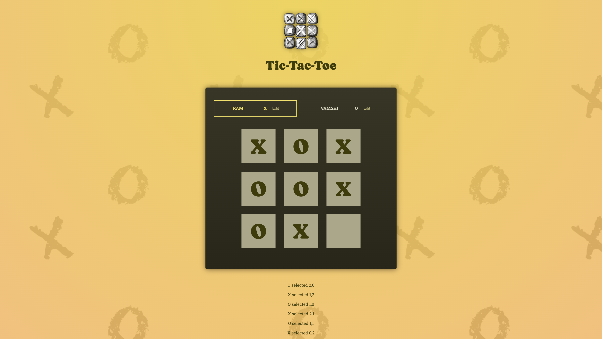

<h1> Tic-Tac-Toe </h1>

This is a project to refresh my knowledge on useState Hook in react. Features include

<ol>
<li>
Create a dynamic 3x3 Tic-Tac-Toe grid using an array of arrays to represent buttons, allowing players to make alternating selections during the game.</li>
<li>Custom Players Name Using useState Hook</li>
<li>Logging - to verify the history of moves made by players on board</li>
</ol>

